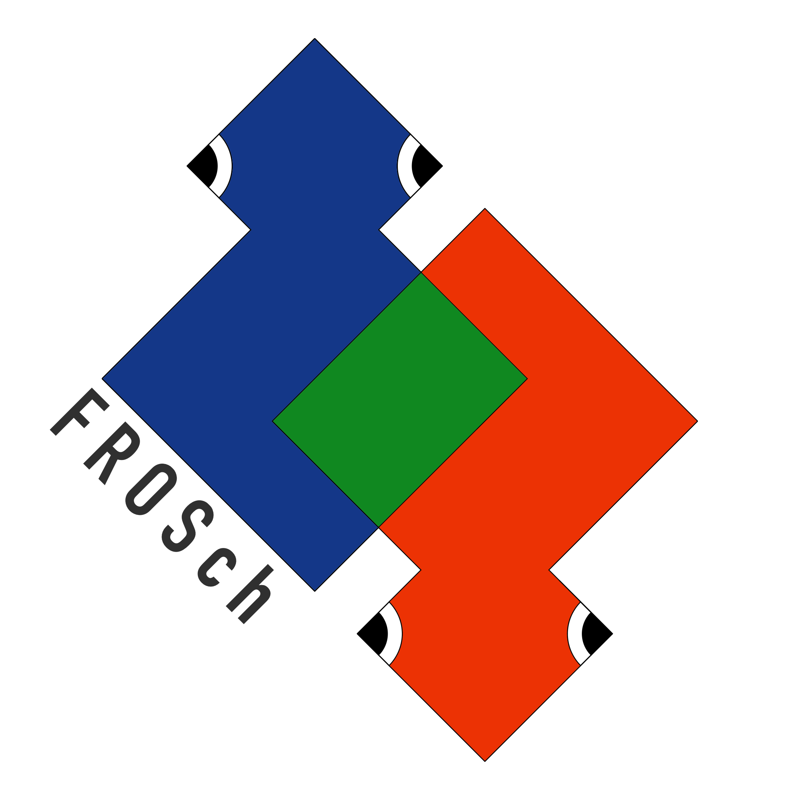

*FROSch* (*F*ast and *R*obust *O*verlapping *Sch*warz) is a framework for parallel overlapping Schwarz preconditioners in Trilinos. It is designed to be used as an algebraic solver for discrete problems arising from continuum mechanical problems. The framework is part of the Trilinos package ShyLU and it offers a range of functions for the construction and combination of various Schwarz preconditioners.

The *FROSch* code is availble on <a href="https://github.com/trilinos/Trilinos/tree/master/packages/shylu/shylu_dd/frosch" target="_blank">GitHub</a> as part of <a href="https://github.com/trilinos/Trilinos" target="_blank">Trilinos</a>.
For more information, see [About](/about) and the ShyLU user guide.

<!-- -->

To cite *FROSch*, please refer to:



More publications related to *FROSch* are listed [here](/publications).
